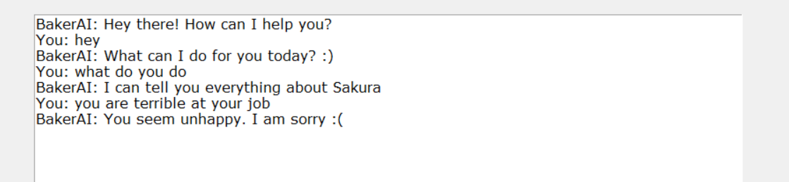
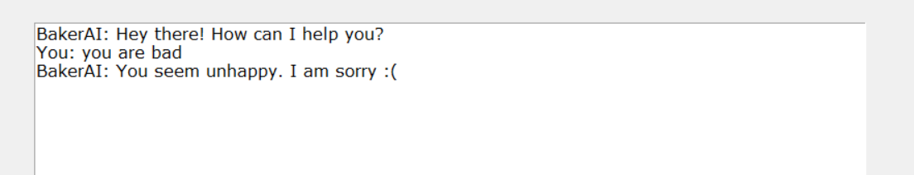
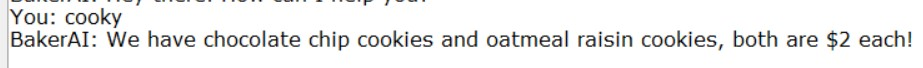
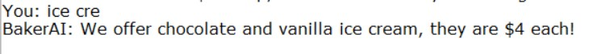
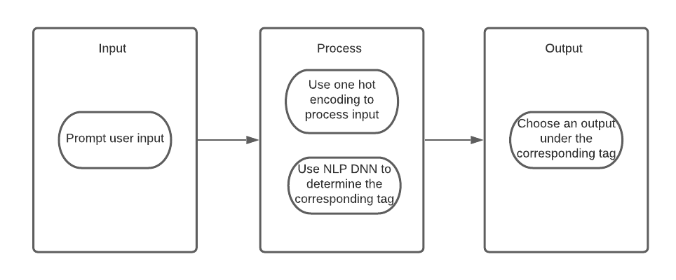

# Bakerai

## Bakerai is an online chatbot for a imaginary bakery - SAKURA. Bakerai acts as your online assistant to provide customer information they need about SAKURA without leaving the comfort of their home.

## Features implemented in A3:

* ###   GUI
    Elias Pinno, was tasked with implementing the GUI front end for our bot. This involved several key steps:
    * Step 1: Selecting a GUI framework within the given constraints
    * Step 2: Code framework reuse from a previous project i've worked on personally
    * Step 3: The modifcation and adoption of that code to be a workable project for the GUI
    * Step 4: Hooking up our Chat AI as an endpoint, and begin sending client inputs to the bot
    * Step 5: Final cleanup stage

    ## How did this feature improve the project?
    This feature was used to improve the interaction between users and the AI, to make talking with the AI more pleseant and more usable outside of strict command line environment. It's visually more pleasing, and opens the possiblity for further features in the future (though in the long run, this product would likely be implemented as a part of a server)

    ## Conversation snippet?
    Below is a conversation snippet:
    image here

* ###   Socket communication
    Socket communication was another feature we chose to implement, done by Elias Pinno. It was unfortunately not included in the GUI, but still works as a proof of concept in client.py and server.py. You can still have conversations with the AI via a remote connection, just not via the GUI. It also involved a lot of refactoring which made the code base a lot easier to call from remote files.

    ## How did this feature improve the project?
    This feature lays the ground work for the projects actual use case, remote conversation with the AI to learn more information about our hypothetical bakery. While in the future, this is more likely to be done via web connection, having even a client server backend set up to allow this is already promising.

    ## Conversation snippet
    Below is a conversation snippet:
    image here

* ###    Sentiment Analysis
    Kanishka Verma, was tasked to implement Sentiment Analysis to improve conversation flow.
    * Step 1: I found a dataset of amazon reviews. The dataset comprised of thousands of reviews.
    * Step 2: Using Pandas,I cleaned the data and then subset the data to only information I needed which was the reviewText and
            the rating.
    * Step 3: I made a new column in the data and assigned each review a positive, negative rating depending on the rating  
            (num of stars on the review).
    * Step 4: Using Pandas, I was able to sample the reviews to obtain testing and training data. Moreover, I made sure there
            was an equal propotion of negative and positive reviews as in the original data, there were too many positive reviews.
    * Step 5: Using the python library, Scikit-learn, I used a bag of words vectorizer to encode the text data in a bag of      words matrix. This technique is also used in our bot.
    * Step 6: I used several machine learning models and tested the accuracy of the model on testdata. I, then, picked the model with best accuracy and then saved that model.
    * Step 7: We had to change the code in our main file main.py to now use this sentiment analysis model to make better predictions.

    ### How the model was used

    The model is use to classify user input as either positive and negative and if negative connotation is detected with the user input, then the model apologizes to the user. This was not possible with the previous iteration of the chat-bot.  
    ### Screenshot of the feature in action.
    

    

* ###    Spelling Mistakes Handler
    Novia Fan and Rick Feng was tasked to implement spell check for all user input for better prediction for model.
    * Step 1: Tokenize all patterns into bag of words with porter stemmer
    * Step 2: Send bag of words into the model as input training data
    * Step 3: Create and train the Neural Network model so it recognizes spelling mistakes
    * Step 4: Both NN.py and process_data,py has to adopt with porter stemmer(lancaster stemmer was used before)
    * Step 5: Any word that is inputed by user can be recogized as long as its still similar in spelling.

    ### How the model was used

    The model is used to chekc spelling mistakes that user might make wjile inputing question for the bot to answer. If user input word that resemble a word within patterns. The model will predict with this information in mind.

    ### Screenshot of the feature in action.
    

    

    

## How to run

step_0: clone the repo.  
step_1: ensure you have Python 3.6+.  
step_2: pip install all the required libraries.  
step_3: Just run `main.py`. (the model is already uploaded so there will be no training necessary. To see how the model was trained, check `NN.py` and `process_data.py`)  
step_4: after running `main.py`, there will be a few tensorflow warnings followed by
"Hello! This is the chatbot. I am here to make your shopping experience at Sakura effortless! (type 'quit' to quit.) Let's chat:"  
This means the project is running and you can simply type the questions you have for the bot.

## Project Structure

bakerai has the following file structure:

 ---process_data.py  
 ---NN.py  
 ---main.py     
 ---server.py   
 ---unit-testing.py     
 ---client.py       
 ---clientGUI.py        
 ---sentiment_analysis.py     
 ---sentiment_analysis.ipynb      
 ---intents.json        
    
We have four files which all have one specific purpose as asked by the requirements.

### `process_data.py`

This file contains code which helps process our 'intents.json' file into a numpy array where each word's frequency corresponds to a cell in multi-dimensional numpy array. This structure is called bag of words in machine learning.

### `NN.py`

This file is where the model is trained. after running process_data.py, run this file next.
We were smart enough so that the code checks first if there is already a model present within the file structure. If not, only then the code uses Tensorflow to train a new model from the bag of words input provided by process_data.py

### `main.py`

This is the file which handles interacting with the model. we have a start function which has a while loop so that the user can query the model repeatedly. In the start function, we use the 'convert_input_to_bow()' function from NN.py which converts user input to the bag of words structure (previously mentioned). Then we use the model imported from NN.py, and use TensorFlow's inbuilt 'predict' function. We feed it the output from 'convert_input_to_bow()' function and it uses the model to give us a reply from the 'bot'.
We then do some processing and return a random response from intents.json depending on what the model classified the input as.

### `intents.json`

This is the data which the model is trained on. The model uses the 'tags' and 'patterns' as input when training. Then the trained model is able to take in some text, compare it with the 'patterns' section of each tag and then try to classify the 'tag' depending on the input. Once we have a 'tag' we just return one of the strings from the 'responses' section of the corresponding tag.

### Features: Which could be extracted as an API

## Functions

- Customer service and support.
- Provide information about products and services to the customer.

## Implementation

Bakerai uses advanced Natural Langugage Processing Techniques and Machine Learning Models to tailor responses specially to your needs.

some libraries which were used:

- numpy, ntlk, tensorflow, tflearn, pickle

The software architecuture diagram is shown as follows:

## Requirements Definition

The ChatBot Bakerai should be able to answer basic day to day questions about the bakery and should keep customers entertained while they are waiting for their purchases??.
The ChatBot should be setted as an online assistant, to give customer information about the bakery before they come, so they can decide whether or not they want to visit.
AND customers can also order from the chatbot (future implementation) when they are in store.

It should be able to answer questions like:

Where is the bakery?

What is the hours of the bakery?

What baked goods are offered?

What specific items cost?

Potential allergies?

## Sample Input Ideas.

- greetings
- ask about location
- ask about time
- ask about menu
- ask about allergy
- ask about gluten free
- ask to buy cookie
- ask to buy coffee with cookie
- ask about customize cake
- ask to buy a cupcake for taste test haha
- Ask to tell a joke

### This is the official repository hosting the code which powers Bakerai. Feel free to take a look!

# bye - made with ♥ for COSC 310 [Software Engineering]
### -Team 27: Elias Pinno, Kanishka Verma, Lydia Lin, Rick Feng, Novia Fan
